# ☸️ Production-Grade GitOps CI/CD Platform on AWS (HA Kubernetes + GitLab + Harbor + ArgoCD)

[](https://gitlab.com/doanhiep169/app-code/-/commits/main)

[](https://aws.amazon.com/)
[](https://www.terraform.io/)
[](https://kubernetes.io/)
[](https://argo-cd.readthedocs.io/)
[](https://gitlab.com/)
[](https://goharbor.io/)
[](https://helm.sh/)
[](https://letsencrypt.org/)
[](https://prometheus.io/)
[](https://grafana.com/)
[](https://velero.io/)
[](https://github.com/bitnami-labs/sealed-secrets)

<details>
<summary><strong>📑 Table of Contents (Click to expand)</strong></summary>

- 📌 [Introduction](#introduction)
- 🚀 [Key Features](#key-features)
- 🏗️ [Architecture Overview](#architecture-overview)
- 📁 [Project Structure](#project-structure)
- 🛠️ [Technologies Used](#technologies-used)
- ☁️ [AWS Infrastructure Setup](#aws-infrastructure-setup)
- 💻 [Quick Start](#quick-start)
- ✅ [1. Highly Available 8-Node Infrastructure](#step-1)
- 🔐 [2. Secretless Control Plane (IAM Role, no static keys)](#step-2)
- 🔒 [3. Custom Domain & Valid HTTPS Certificates](#step-3)
- 🚀 [4. GitLab CI/CD Pipeline (test → scan → build → update-chart)](#step-4)
- 🐳 [5. Private Registry with Vulnerability Scanning](#step-5)
- 🔄 [6. GitOps Multi-Environment Delivery via ArgoCD](#step-6)
- 🔑 [7. Secrets Management with Sealed Secrets](#step-7)
- 📊 [8. Monitoring & Alerting (Prometheus/Grafana/Telegram)](#step-8)
- 💾 [9. Disaster Recovery with Velero](#step-9)
- ✅ [Full System Checklist](#full-system-checklist)
- ⚠️ [Troubleshooting & Lessons Learned](#troubleshooting-lessons-learned)
- 🎓 [Lessons Learned Summary](#lessons-learned-summary)
- 🔮 [Production Gaps & Future Improvements](#future-production-improvements)
- 👤 [Author](#author)

</details>

---

<h2 id="introduction">📌 Introduction</h2>

This repository documents an end-to-end, self-managed **GitOps CI/CD platform** built from scratch on **AWS EC2**, going well beyond a toy 2-node cluster demo. It provisions a **highly available 3-master Kubernetes cluster** (via `kubeadm`, spread across 3 Availability Zones behind a Network Load Balancer) plus dedicated **GitLab CE** and **Harbor** VMs — 8 EC2 instances in total, fully defined in Terraform.

On top of the infrastructure, the pipeline drives a complete **GitOps loop**: every Git tag triggers a GitLab CI pipeline that tests, security-scans (Trivy), builds and pushes an image to a private Harbor registry, then auto-commits the new tag into a Helm chart repo — which **ArgoCD** picks up and syncs to three isolated environments (`dev` / `staging` / `prod`) via a single `ApplicationSet`. Secrets are never stored in plaintext in Git (**Sealed Secrets**), the cluster is observed end-to-end with **Prometheus/Grafana** and **Telegram alerting**, and the whole platform is protected by **Velero** backup/restore against etcd, EC2, and human-error disasters.

The entire journey — including every real error encountered along the way (Terraform HCL syntax, NLB hairpinning, containerd registry config, ArgoCD CRD size limits, Sealed Secrets namespace scoping, Let's Encrypt HTTP-01 challenges, etcd quorum loss on resume, DNS TTL caching, and more) — is captured in the [Troubleshooting & Lessons Learned](#troubleshooting-lessons-learned) section as a real deployment log, not just a "happy path" guide.

---

<h2 id="key-features">🚀 Key Features</h2>

* 🏗️ **HA Kubernetes Control Plane**: 3 master nodes spread across 3 AZs, fronted by an internal AWS Network Load Balancer with cross-zone load balancing, so the API server survives a single AZ or master failure.
* 🔐 **Secretless Automation VM**: A dedicated `control-vm` (replacing a personal laptop) drives Terraform/`kubectl`/Helm using an **IAM Instance Role** — zero static AWS access keys stored anywhere.
* 🔄 **Full GitOps Loop**: `git tag` → GitLab CI (test → scan → build → update-chart) → Harbor registry → auto-commit to Helm chart repo → **ArgoCD ApplicationSet** fans out to `dev`/`staging`/`prod` automatically.
* 🛡️ **Real HTTPS Everywhere**: `cert-manager` + Let's Encrypt HTTP-01 for the app ingress, plus a separate, fully documented workflow to enable real TLS certificates for the internal tooling (GitLab, Harbor, ArgoCD) on a dedicated admin domain.
* 🧪 **Shift-Left Security**: Every image build is scanned with **Trivy** (`--severity HIGH,CRITICAL`) inside the pipeline before it's ever pushed to the registry.
* 🔑 **GitOps-Safe Secrets**: Kubernetes Secrets are sealed per-namespace with **Sealed Secrets** (`kubeseal`) before being committed to Git — safe to store in a public or shared repo.
* 📊 **Full-Stack Observability**: `kube-prometheus-stack` (Prometheus + Grafana + Alertmanager) with a minimum viable alert set (`PodCrashLooping`, etc.) routed to **Telegram** in real time.
* 💾 **Disaster Recovery, Actually Tested**: **Velero** scheduled backups to S3 with filesystem-level volume backup (no VolumeSnapshotClass required on a self-managed kubeadm cluster), validated with a real delete → restore drill.

---

<h2 id="architecture-overview">🏗️ Architecture Overview</h2>

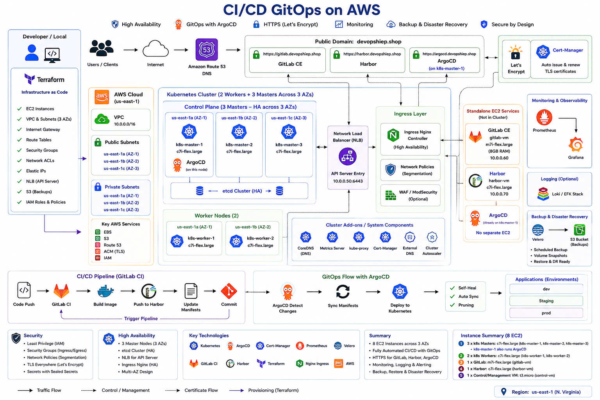

---

<h2 id="project-structure">📁 Project Structure</h2>

```text
gitops-lab-aws/
├── terraform/
│   ├── versions.tf          # Provider pin + S3 backend (locked with DynamoDB)
│   ├── variables.tf         # Region, instance types, admin_cidr
│   ├── network.tf           # VPC + 3 public subnets across 3 AZs
│   ├── security_groups.tf   # Least-privilege SGs (k8s, gitlab_harbor, control-vm)
│   ├── iam.tf                # control-vm role + node role (Velero, no static creds)
│   ├── loadbalancer.tf      # Internal NLB for the K8s API server (cross-zone)
│   ├── instances.tf         # 3 master + 2 worker EC2s, spread across AZs
│   └── keypair.tf
├── app-code/                 # Application source
│   ├── Dockerfile             # Multi-stage, npm stripped from runtime image
│   ├── src/
│   └── .gitlab-ci.yml         # test → sast-scan → build (Trivy) → update-chart
├── helm-chart/                # GitOps source of truth, watched by ArgoCD
│   ├── Chart.yaml
│   ├── values.yaml
│   ├── values-dev.yaml
│   ├── values-staging.yaml
│   ├── values-prod.yaml
│   └── templates/
└── argocd/
    └── applicationset.yaml    # Fans out to myapp-dev / myapp-staging / myapp-prod
```

---

<h2 id="technologies-used">🛠️ Technologies Used</h2>

| Component | Technology | Description |
|---|---|---|
| **IaC** |  | 8 EC2 instances, VPC/subnets, SGs, IAM roles, NLB — S3 backend with DynamoDB state locking |
| **Cloud Provider** |  | `us-east-1`, 3 AZs, `c7i-flex.large` (K8s nodes) / `m7i-flex.large` (GitLab CE) |
| **Orchestration** |  | HA cluster via `kubeadm` (3 master / 2 worker), CNI powered by Calico |
| **Load Balancing** | AWS NLB | Internal, cross-zone-enabled NLB fronting the API server on port 6443 |
| **CI/CD** |  | Self-hosted GitLab CE + shell/Docker executor Runner |
| **Container Registry** |  | Self-hosted private registry, project-scoped access |
| **GitOps CD** |  | `ApplicationSet` driving 3 independent environments from one Helm chart |
| **Package Management** |  | Per-environment `values-*.yaml` overrides |
| **Ingress & TLS** |   | `hostNetwork` DaemonSet Ingress + `cert-manager` HTTP-01 challenges |
| **Secrets Management** | Sealed Secrets (`kubeseal`) | Per-namespace encrypted secrets, safe to commit to Git |
| **Security Scanning** |  | HIGH/CRITICAL CVE gate inside the `build-image` CI job |
| **Monitoring** |   | `kube-prometheus-stack`, alerts routed to Telegram |
| **Disaster Recovery** |  | Scheduled S3 backups with filesystem-level volume backup (no CSI snapshot CRDs needed) |

---

<h2 id="aws-infrastructure-setup">☁️ AWS Infrastructure & Kubernetes Bootstrapping</h2>

### 1. Control VM (replaces a personal laptop)
A dedicated `control-vm` EC2 instance (in the same VPC as the cluster) runs Terraform, `kubectl`, `helm`, `aws-cli`, and `kubeseal`. It authenticates to AWS purely through an **attached IAM Instance Role** — no `aws configure`, no static access keys anywhere on disk.

### 2. Terraform-Provisioned Infrastructure
* **VPC**: `10.0.0.0/16` with 3 public subnets, one per Availability Zone.
* **Kubernetes nodes**: 3 masters (1 per AZ) + 2 workers, `c7i-flex.large` (2 vCPU / 4GB, compute-optimized).
* **GitLab CE**: 1 EC2, `m7i-flex.large` (8GB RAM — verified minimum after `t3.medium` caused multi-minute freezes during `gitlab-ctl reconfigure`), attached Elastic IP.
* **Harbor**: 1 EC2, `c7i-flex.large`, attached Elastic IP.
* **Network Load Balancer**: internal, `enable_cross_zone_load_balancing = true`, fronting the API server on port 6443 so any master can fail without breaking `kubeadm join`/`kubectl`.
* **Security Groups**: least-privilege, self-referencing rules for the K8s control-plane/etcd/kubelet port ranges; a separate SG for the GitLab/Harbor VMs; SSH restricted to `admin_cidr` only.
* **State**: S3 backend with `encrypt = true`, locked via a DynamoDB table.

### 3. Kubernetes Cluster Bootstrap (HA)
1. Prepare all 5 K8s nodes (disable swap, sysctl, `containerd`, `kubeadm`/`kubelet`/`kubectl`).
2. `kubeadm init --control-plane-endpoint <NLB DNS>:6443 --upload-certs` on `master-1`.
3. `kubeadm join --control-plane ...` on `master-2`/`master-3` against the NLB endpoint.
4. `kubeadm join ...` on both workers.
5. Deploy Calico as the pod network CNI.
6. Point DNS (Route53) at the Ingress, install NGINX Ingress in `hostNetwork` mode, and issue certificates with `cert-manager` + Let's Encrypt.

---

<h2 id="quick-start">💻 Quick Start</h2>

### Prerequisites
* AWS account with permissions to create VPC/EC2/IAM/S3/DynamoDB resources
* A registered domain (for Route53 + Let's Encrypt HTTP-01)
* `terraform`, `kubectl`, `helm`, `kubeseal` (all installed automatically on `control-vm` in Step 0)

### Step 1 — Provision infrastructure
```bash
terraform init
terraform apply
```

### Step 2 — Bootstrap the HA cluster
```bash
sudo kubeadm init --control-plane-endpoint <k8s_api_lb_dns>:6443 --upload-certs
# join master-2, master-3, worker-1, worker-2 using the printed commands
```

### Step 3 — Ship code through the GitOps loop
```bash
git tag v0.1.0
git push origin v0.1.0
# GitLab CI: test → sast-scan → build (Trivy) → update-chart
# ArgoCD auto-syncs myapp-dev / myapp-staging / myapp-prod
```

---

<h2 id="step-1">✅ 1. Highly Available 8-Node Infrastructure</h2>

3 master nodes rebooted or lost individually should not take down the API server. Verify all nodes are `Ready` and spread across distinct AZs:

```bash
kubectl get nodes -o wide
```

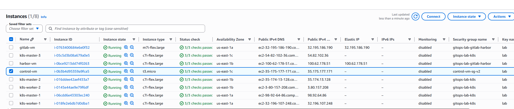
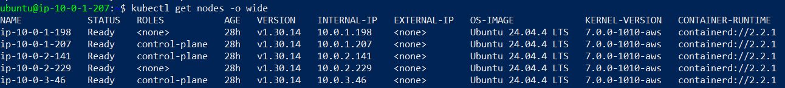
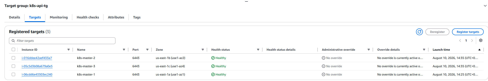

<h2 id="step-2">🔐 2. Secretless Control Plane (IAM Role, no static keys)</h2>

```bash
aws sts get-caller-identity
# → arn:aws:sts::<account>:assumed-role/control-vm-role/...
```
No `~/.aws/credentials` file with a static access key should exist on `control-vm`.

<h2 id="step-3">🔒 3. Custom Domain & Valid HTTPS Certificates</h2>

The application is exposed over HTTPS with a Let's Encrypt certificate automatically issued and renewed by `cert-manager` via HTTP-01 challenges:

```bash
curl https://<your-domain>
kubectl get certificate -A
```


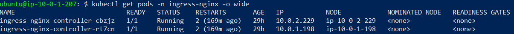

A second, separately documented pass (see NHÓM 9 in the deployment log) enables **real TLS on the internal admin tools** (GitLab, Harbor, ArgoCD) on a dedicated admin subdomain.

| GitLab | Harbor | ArgoCD |
|---|---|---|
| 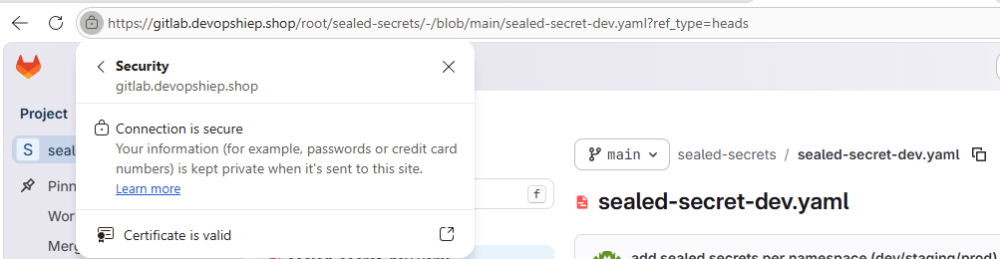 | 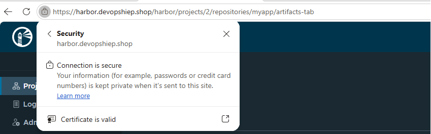 | 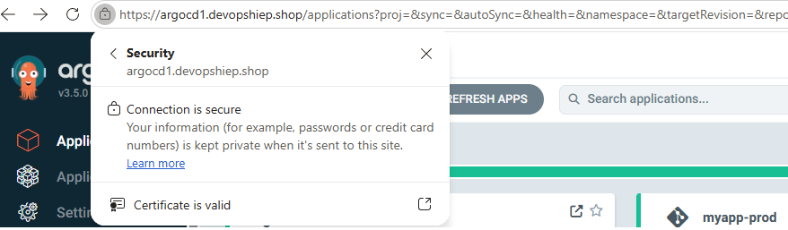 |

<h2 id="step-4">🚀 4. GitLab CI/CD Pipeline</h2>

Every tagged commit runs all 4 stages — `test → sast-scan → build → update-chart` — the last of which commits the new image tag back into the Helm chart repo automatically.

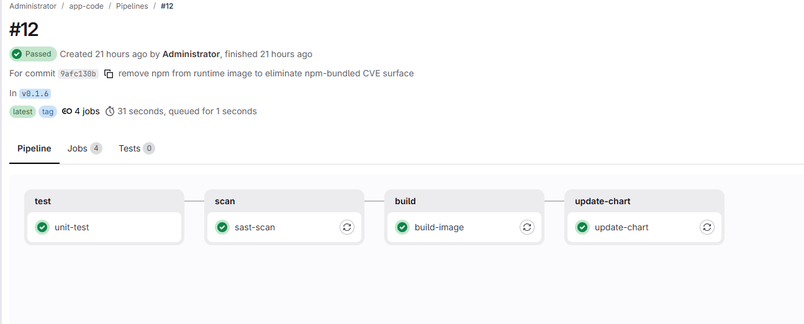

<h2 id="step-5">🐳 5. Private Registry with Vulnerability Scanning</h2>

The `build-image` job runs Trivy inside the pipeline and fails the build on any `HIGH`/`CRITICAL` CVE **before** the image is pushed to Harbor:
```bash
docker run --rm -v /var/run/docker.sock:/var/run/docker.sock aquasec/trivy:latest \
  image --exit-code 1 --severity HIGH,CRITICAL $IMAGE:$CI_COMMIT_TAG
```

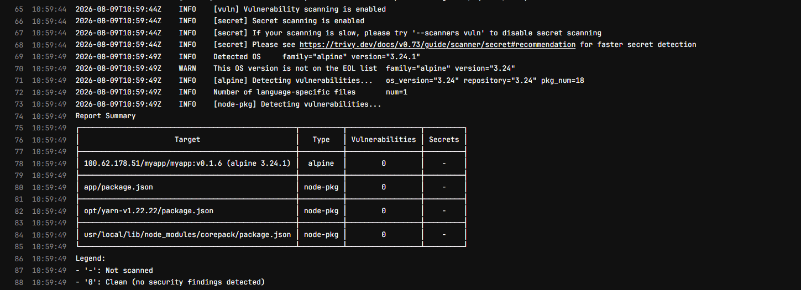
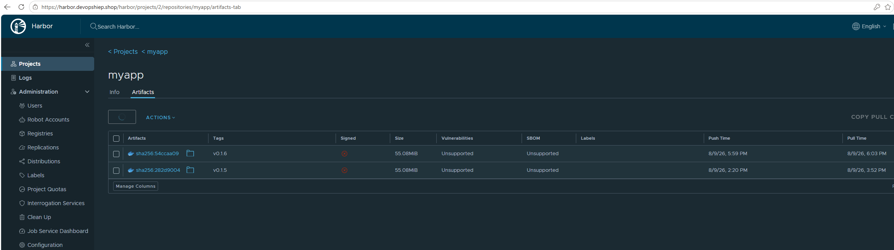

<h2 id="step-6">🔄 6. GitOps Multi-Environment Delivery via ArgoCD</h2>

A single `ApplicationSet` generates 3 independent ArgoCD Applications from one Helm chart:
```bash
kubectl get applications -n argocd
# myapp-dev       Synced   Healthy
# myapp-staging   Synced   Healthy
# myapp-prod      Synced   Healthy
```

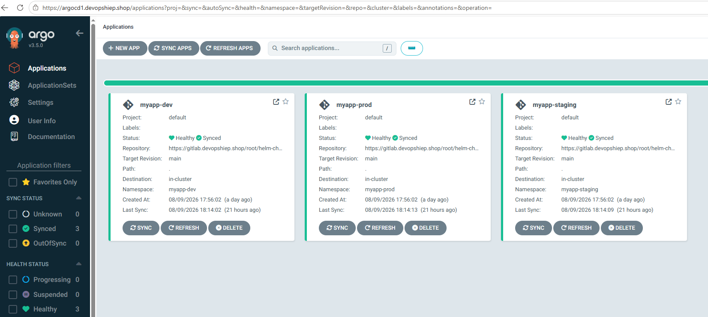
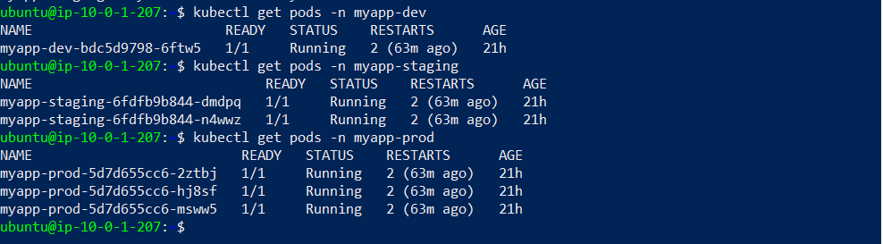

<h2 id="step-7">🔑 7. Secrets Management with Sealed Secrets</h2>

Secrets are sealed per-namespace before being committed — the repo only ever contains `SealedSecret` objects with `encryptedData`, never plaintext:
```bash
kubeseal --format yaml --controller-name=sealed-secrets --controller-namespace=kube-system \
  < secret.yaml > sealed-secret.yaml
```

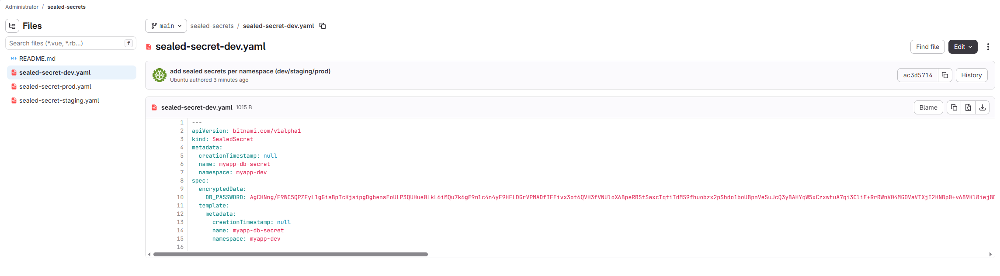

<h2 id="step-8">📊 8. Monitoring & Alerting</h2>

`kube-prometheus-stack` ships Prometheus, Grafana, and Alertmanager, with a `PodCrashLooping` alert wired to Telegram for real-time notification.

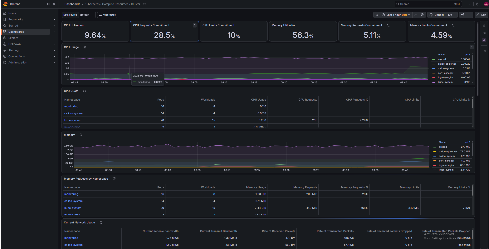
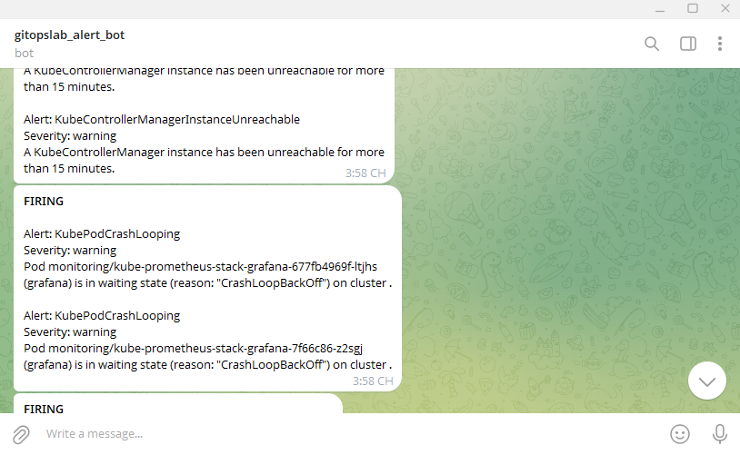

<h2 id="step-9">💾 9. Disaster Recovery with Velero</h2>

Scheduled backups to S3, restore-tested against a real deleted environment:
```bash
velero backup get
velero restore create --from-backup <backup-name> --include-namespaces myapp-dev
kubectl get pods -n myapp-dev
```

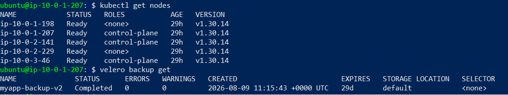

**Restore drill on `myapp-dev`** (chosen to keep `prod` untouched):

| Before restore (deployment deleted) | After restore (`velero restore create`) |
|---|---|
| 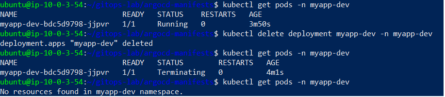 | 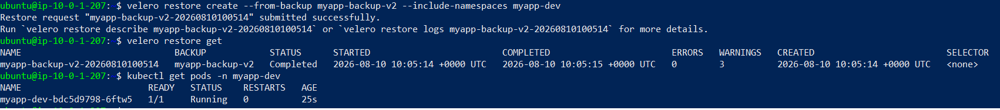 |

---

<h2 id="full-system-checklist">✅ Full System Checklist</h2>

**Control VM**
- [x] SSH from laptop only succeeds from the declared `control-vm-sg` IP
- [x] `aws sts get-caller-identity` returns an assumed IAM role, no static keys

**HA Infrastructure**
- [x] `terraform output k8s_api_lb_dns` returns a valid DNS name
- [x] 5 K8s nodes `Ready`, correctly spread across 3 AZs
- [x] `curl -k https://<k8s_api_lb_dns>:6443/healthz` returns `ok`

**DNS / TLS**
- [x] DNS resolves to the correct Route53-declared IP
- [x] `curl https://<domain>` raises no certificate errors
- [x] `kubectl get certificate -A` reports `READY: True`

**CI/CD & GitOps**
- [x] Tag push on `app-code` → all 4 pipeline stages pass → `helm-chart` auto-committed
- [x] All 3 ArgoCD Applications `Synced` + `Healthy`
- [x] No plaintext secrets in Git — only `SealedSecret`

**Observability**
- [x] Grafana reachable, default cluster dashboards visible
- [x] `PodCrashLooping` alert present (`kubectl get prometheusrule -A`)

**Backup & DR**
- [x] EBS CSI Driver active (`kubectl get storageclass`)
- [x] At least one `Completed` Velero backup
- [x] Restore drill performed at least once (delete namespace → restore)

---

<h2 id="troubleshooting-lessons-learned">⚠️ Troubleshooting & Lessons Learned</h2>

This platform was built end-to-end, and every real failure was logged and fixed rather than glossed over. A representative sample:

| # | Area | Problem | Root Cause | Fix |
|---|---|---|---|---|
| 1 | Terraform (HCL) | `terraform init` failed with `Error: Invalid single-argument block definition` | `ingress`/`egress`/`filter` blocks were written with multiple attributes on a single line — HCL only allows single-line blocks with exactly one attribute | Rewrote all affected blocks to one attribute per line |
| 2 | NLB / Cluster Join | `kubeadm join --control-plane`/`join` from `master-2/3` and the workers hung indefinitely with `Connection timed out` against the NLB DNS, while `control-vm` itself worked fine | The NLB was `internal = false` (internet-facing) with cross-zone load balancing disabled | Set `internal = true` and `enable_cross_zone_load_balancing = true` |
| 3 | GitLab CE | `gitlab-ctl reconfigure` hung for tens of minutes; CPU sat around ~49%, so the cause wasn't obvious | RAM exhaustion (4GB), not CPU — RAM throttling doesn't always show up clearly in CPU metrics | Upgraded to `m7i-flex.large` (8GB RAM) |
| 4 | ArgoCD | `argocd-applicationset-controller` CrashLoopBackOff; `kubectl apply` on the ArgoCD CRDs failed with `metadata.annotations: Too long: must have at most 262144 bytes` | The `ApplicationSet` CRD schema exceeds the 256KB client-side `last-applied-configuration` annotation limit, even when applied file-by-file | `kubectl apply --server-side --force-conflicts` |
| 5 | Sealed Secrets | A `SealedSecret` sealed once and reused across `dev`/`staging`/`prod` failed to decrypt in 2 of the 3 namespaces (`no key could decrypt secret`) | `kubeseal`'s default scope binds the ciphertext to one exact `(namespace, name)` pair | Seal a separate `SealedSecret` per namespace, and add `ignoreDifferences` in ArgoCD to avoid false `OutOfSync` on the `status` field |
| 6 | Ingress / TLS | A domain pointed at a master node's IP got `connection refused` on the Let's Encrypt HTTP-01 challenge | The `ingress-nginx-controller` DaemonSet (`hostNetwork: true`) is not scheduled onto control-plane nodes, which carry a `NoSchedule` taint | Point DNS at the IP of a **worker** node actually running the Ingress pod (`kubectl get pods -n ingress-nginx -o wide` to confirm) |
| 7 | etcd / HA | After stopping/starting EC2 instances for a break, `kube-apiserver` crash-looped with `RAFT NO LEADER` | The 3 master nodes were started one at a time rather than together — etcd requires 2 of 3 members up to maintain quorum | Start all master nodes together (near-simultaneously) when resuming the cluster |

> The full deployment log — with 9 issue groups and 40+ documented real errors, root causes, and fixes across Terraform, cluster bootstrap, CNI, Ingress/TLS, registry/Docker, CI/CD & ArgoCD, observability, Velero, and HTTPS for internal tooling — is maintained separately as the project's incident journal.

---

<h2 id="lessons-learned-summary">🎓 Lessons Learned Summary</h2>

1. **Bastion/control VM must live in the same VPC** as the cluster to avoid routing/SG surprises.
2. **Avoid overwriting entire `.tf` files for Security Groups** — edit in place to avoid dropping previously configured rules.
3. **`iptables REDIRECT` is the wrong tool for port 80/443 → NodePort mapping** — a `hostNetwork` DaemonSet Ingress Controller is the correct, stable approach.
4. **RAM exhaustion is an underrated cause of services "randomly" freezing** — check CPU → status checks → disk I/O → **RAM**, since throttling doesn't always show up in CPU%.
5. **Large-schema CRDs (ApplicationSet, cert-manager, Prometheus Operator) need `--server-side --force-conflicts`** with `kubectl apply`.
6. **SealedSecrets are not multi-environment by default** — seal per-namespace, and manage separately from a shared Helm chart.
7. **`ignoreDifferences` in ArgoCD is essential** whenever a controller writes runtime fields back onto managed resources.
8. **SSH between EC2s in the same VPC should use private IPs**, not public IPs — public-IP hairpinning behavior is inconsistent.
9. **EC2 instances without an Elastic IP change their public IP on every Stop/Start** — any DNS record pointed directly at a node IP needs to be re-checked after a resume.
10. **etcd needs 2/3 quorum** — start all HA master nodes together when resuming a stopped cluster.
11. **DaemonSet + `hostNetwork` Ingress won't schedule on tainted control-plane nodes** — always verify with `kubectl get pods -o wide` before pointing DNS.
12. **DNS caching is per-machine and TTL-bound** — don't conclude "DNS hasn't propagated" from a single host; Pod-level (CoreDNS) cache is independent from node OS cache.

---

<h2 id="future-production-improvements">🔮 Production Gaps & Future Improvements</h2>

This project was built for hands-on learning and portfolio demonstration. For a genuine production rollout, the following would still be needed:

- **Managed control plane or a hardened HA story**: consider EKS, or add etcd snapshotting/monitoring beyond Velero's fs-backup.
- **GitLab/Harbor backup & DR**: currently out of the original lab scope — only the Kubernetes workloads are covered by Velero.
- **Automated per-environment chart updates**: the `update-chart` CI job should update all of `values-dev/staging/prod.yaml`, not just the root `values.yaml`.
- **External secret manager**: migrate from Sealed Secrets to Vault/AWS Secrets Manager for centralized rotation and audit.
- **Network Policies & tighter RBAC**: enforce least-privilege namespace isolation.
- **WAF / rate limiting** in front of the public Ingress.

---

<h2 id="author">👤 Author</h2>

**Doan Minh Hiep**

* **GitHub**: [@minhhiep05](https://github.com/minhhiep05)
* **GitLab**: [@doanhiep169](https://gitlab.com/doanhiep169)
* **Email**: [doanhiep169@gmail.com](mailto:doanhiep169@gmail.com)
